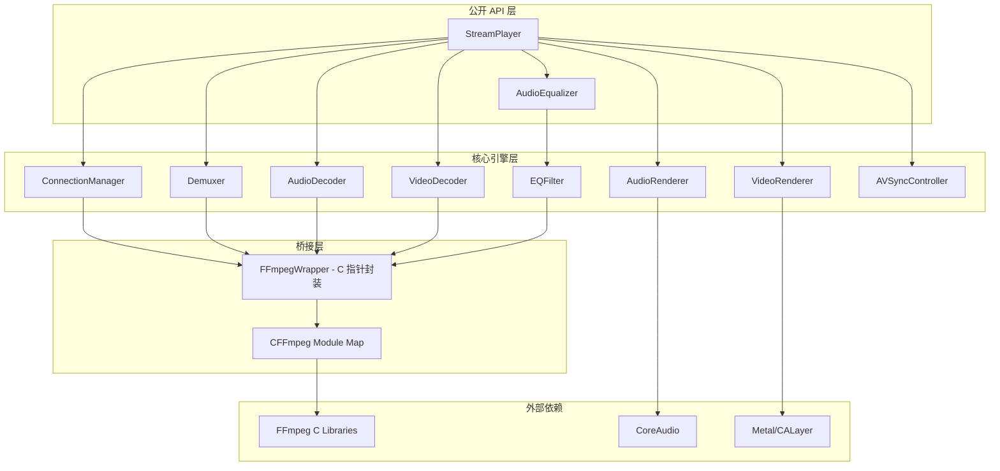
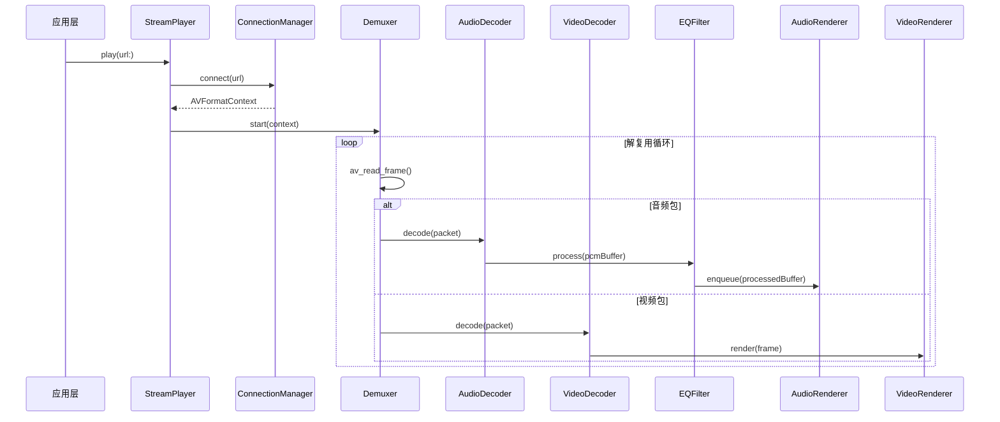
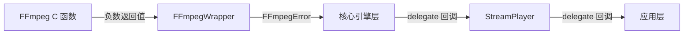

# 设计文档

## 概述

FFmpeg Swift SDK 通过 C bridging 层封装 FFmpeg 底层能力，向 Swift 开发者暴露类型安全、内存安全的 API。整体架构采用分层设计：底层为 FFmpeg C 桥接模块，中间层为解复用、解码、EQ 滤波等核心引擎，上层为面向开发者的 Swift API。

SDK 以 Swift Package 形式发布，包含两个主要 target：
- `CFFmpeg`：system library target，通过 module map 暴露 FFmpeg C 头文件
- `FFmpegSwiftSDK`：Swift target，依赖 `CFFmpeg`，提供所有公开 API

## 架构



### 数据流



## 组件与接口

### 1. CFFmpeg 模块（桥接层）

通过 `module.modulemap` 文件将 FFmpeg 头文件暴露给 Swift：

```c
module CFFmpeg {
    header "shim.h"  // 包含所有需要的 FFmpeg 头文件
    link "avformat"
    link "avcodec"
    link "avutil"
    link "swresample"
    link "avfilter"
    export *
}
```

`shim.h` 聚合头文件：

```c
#include <libavformat/avformat.h>
#include <libavcodec/avcodec.h>
#include <libavutil/avutil.h>
#include <libswresample/swresample.h>
#include <libavfilter/avfilter.h>
```

### 2. FFmpegWrapper（C 指针封装）

将 FFmpeg 的 C 指针操作封装为 Swift 类，利用 `deinit` 保证资源释放：

```swift
final class FFmpegFormatContext {
    private var pointer: UnsafeMutablePointer<AVFormatContext>?

    init() {
        pointer = avformat_alloc_context()
    }

    func openInput(url: String) throws {
        var ctx = pointer
        let ret = avformat_open_input(&ctx, url, nil, nil)
        guard ret >= 0 else { throw FFmpegError.from(code: ret) }
        pointer = ctx
    }

    deinit {
        if pointer != nil {
            var ctx = pointer
            avformat_close_input(&ctx)
        }
    }
}
```

### 3. ConnectionManager

负责建立和管理流媒体连接：

```swift
protocol ConnectionManagerDelegate: AnyObject {
    func connectionManager(_ manager: ConnectionManager, didChangeState state: ConnectionState)
    func connectionManager(_ manager: ConnectionManager, didFailWith error: FFmpegError)
}

final class ConnectionManager {
    enum ConnectionState {
        case idle, connecting, connected, disconnected, failed(FFmpegError)
    }

    private let timeoutInterval: TimeInterval = 10.0
    private let workQueue = DispatchQueue(label: "com.ffmpeg-sdk.connection")

    func connect(url: String) async throws -> FFmpegFormatContext
    func disconnect()
}
```

### 4. Demuxer

从容器格式中分离音视频流：

```swift
final class Demuxer {
    enum PacketType {
        case audio(AVPacket)
        case video(AVPacket)
    }

    private let formatContext: FFmpegFormatContext
    private var audioStreamIndex: Int32 = -1
    private var videoStreamIndex: Int32 = -1

    func findStreams() throws -> StreamInfo
    func readNextPacket() throws -> PacketType?
}
```

### 5. AudioDecoder / VideoDecoder

```swift
protocol Decoder {
    associatedtype Output
    func decode(packet: AVPacket) throws -> Output
    func flush()
}

final class AudioDecoder: Decoder {
    typealias Output = AudioBuffer  // PCM 数据封装
    private var codecContext: UnsafeMutablePointer<AVCodecContext>?
    private var resampleContext: UnsafeMutablePointer<SwrContext>?

    func decode(packet: AVPacket) throws -> AudioBuffer
    func flush()
}

final class VideoDecoder: Decoder {
    typealias Output = VideoFrame  // 原始视频帧封装
    private var codecContext: UnsafeMutablePointer<AVCodecContext>?

    func decode(packet: AVPacket) throws -> VideoFrame
    func flush()
}
```

### 6. EQFilter

基于 FFmpeg 的 `avfilter` 或直接 DSP 实现的均衡器：

```swift
public struct EQBandGain {
    public let band: EQBand
    public let gainDB: Float  // -12.0 到 +12.0

    public enum EQBand {
        case low    // 20-300 Hz
        case mid    // 300-4000 Hz
        case high   // 4000-20000 Hz
    }
}

final class EQFilter {
    private let lock = NSLock()
    private var gains: [EQBand: Float] = [.low: 0, .mid: 0, .high: 0]

    /// 线程安全地更新增益参数
    func setGain(_ gain: Float, for band: EQBand) -> Float  // 返回钳位后的值

    /// 处理 PCM 缓冲区，应用 EQ
    func process(_ buffer: AudioBuffer) -> AudioBuffer
}
```

EQ 实现策略：使用二阶 IIR（Biquad）滤波器，每个频段一个 peaking EQ 滤波器。系数根据增益参数实时计算。这种方式比 FFmpeg avfilter graph 更轻量，延迟更低。

Biquad 滤波器传递函数：

```
H(z) = (b0 + b1*z^-1 + b2*z^-2) / (a0 + a1*z^-1 + a2*z^-2)
```

系数计算基于 Audio EQ Cookbook（Robert Bristow-Johnson）的 peaking EQ 公式。

### 7. AVSyncController

基于 PTS 的音视频同步控制器：

```swift
final class AVSyncController {
    private var audioClock: TimeInterval = 0
    private var videoClock: TimeInterval = 0
    private let maxDrift: TimeInterval = 0.040  // 40ms

    /// 根据音频时钟计算视频帧的展示延迟
    func calculateVideoDelay(for pts: TimeInterval) -> TimeInterval

    /// 更新音频时钟
    func updateAudioClock(_ pts: TimeInterval)
}
```

同步策略：以音频时钟为主时钟（master clock），视频帧根据音频时钟调整展示时机。当音视频偏差超过 40ms 时，丢弃或重复视频帧进行补偿。

### 8. AudioRenderer

```swift
final class AudioRenderer {
    private var audioUnit: AudioComponentInstance?
    private let bufferQueue = DispatchQueue(label: "com.ffmpeg-sdk.audio-render")

    func start(format: AudioStreamBasicDescription) throws
    func enqueue(_ buffer: AudioBuffer)
    func pause()
    func resume()
    func stop()
}
```

使用 CoreAudio 的 AudioUnit（RemoteIO）进行音频输出，通过 render callback 从缓冲队列中拉取数据。

### 9. VideoRenderer

```swift
final class VideoRenderer {
    private weak var displayLayer: CALayer?

    func attach(to layer: CALayer)
    func render(_ frame: VideoFrame)
    func clear()
}
```

使用 `CVPixelBuffer` + `CALayer` 或 Metal 进行视频帧渲染。

### 10. StreamPlayer（公开 API）

```swift
public protocol StreamPlayerDelegate: AnyObject {
    func player(_ player: StreamPlayer, didChangeState state: PlaybackState)
    func player(_ player: StreamPlayer, didEncounterError error: FFmpegError)
    func player(_ player: StreamPlayer, didUpdateDuration duration: TimeInterval)
}

public enum PlaybackState {
    case idle, connecting, playing, paused, stopped, error(FFmpegError)
}

public final class StreamPlayer {
    public weak var delegate: StreamPlayerDelegate?
    public private(set) var state: PlaybackState = .idle
    public private(set) var currentTime: TimeInterval = 0
    public private(set) var streamInfo: StreamInfo?

    public let equalizer: AudioEqualizer

    public func play(url: String)
    public func pause()
    public func resume()
    public func stop()
}
```

### 11. AudioEqualizer（公开 API）

```swift
public protocol AudioEqualizerDelegate: AnyObject {
    func equalizer(_ eq: AudioEqualizer, didClampGain original: Float, to clamped: Float, for band: EQBand)
}

public final class AudioEqualizer {
    public weak var delegate: AudioEqualizerDelegate?

    public func setGain(_ gainDB: Float, for band: EQBand)
    public func gain(for band: EQBand) -> Float
    public func reset()  // 所有频段归零
}
```

### 12. FFmpegError

```swift
public enum FFmpegError: Error, CustomStringConvertible {
    case connectionFailed(code: Int32, message: String)
    case connectionTimeout
    case unsupportedFormat(codecName: String)
    case decodingFailed(code: Int32, message: String)
    case resourceAllocationFailed(resource: String)
    case networkDisconnected
    case unknown(code: Int32)

    public var description: String { ... }
    public var ffmpegCode: Int32 { ... }

    static func from(code: Int32) -> FFmpegError
}
```

## 数据模型

### AudioBuffer

```swift
public struct AudioBuffer {
    public let data: UnsafeMutablePointer<Float>
    public let frameCount: Int
    public let channelCount: Int
    public let sampleRate: Int

    /// 缓冲区时长（秒）
    public var duration: TimeInterval {
        TimeInterval(frameCount) / TimeInterval(sampleRate)
    }
}
```

### VideoFrame

```swift
public struct VideoFrame {
    public let pixelBuffer: CVPixelBuffer
    public let pts: TimeInterval
    public let duration: TimeInterval
    public let width: Int
    public let height: Int
}
```

### StreamInfo

```swift
public struct StreamInfo {
    public let url: String
    public let hasAudio: Bool
    public let hasVideo: Bool
    public let audioCodec: String?
    public let videoCodec: String?
    public let sampleRate: Int?
    public let channelCount: Int?
    public let width: Int?
    public let height: Int?
    public let duration: TimeInterval?  // nil 表示直播流
}
```

### EQBand 与 EQBandGain

```swift
public enum EQBand: CaseIterable {
    case low    // 20-300 Hz
    case mid    // 300-4000 Hz
    case high   // 4000-20000 Hz

    public var frequencyRange: ClosedRange<Float> {
        switch self {
        case .low:  return 20...300
        case .mid:  return 300...4000
        case .high: return 4000...20000
        }
    }

    public var centerFrequency: Float {
        switch self {
        case .low:  return 100
        case .mid:  return 1000
        case .high: return 10000
        }
    }
}

public struct EQBandGain {
    public let band: EQBand
    public let gainDB: Float

    public static let minGain: Float = -12.0
    public static let maxGain: Float = 12.0

    /// 将增益值钳位到有效范围
    public static func clamped(_ value: Float) -> Float {
        min(max(value, minGain), maxGain)
    }
}
```


## 正确性属性

*正确性属性是系统在所有有效执行中都应保持为真的特征或行为——本质上是关于系统应该做什么的形式化陈述。属性作为人类可读规范和机器可验证正确性保证之间的桥梁。*

### Property 1: 无效 URL 错误处理

*对于任意* 格式无效或不可达的 URL 字符串，ConnectionManager 的 connect 方法应该抛出 FFmpegError，且错误类型为 connectionFailed 或 connectionTimeout。

**Validates: Requirements 2.4**

### Property 2: 不支持编解码格式错误处理

*对于任意* 不在支持列表（H.264、H.265、AAC、MP3）中的 codec ID，Decoder 初始化应该抛出 FFmpegError.unsupportedFormat，且错误信息中包含 codec 名称。

**Validates: Requirements 3.4**

### Property 3: 音视频同步偏差控制

*对于任意* 单调递增的音频 PTS 序列和视频 PTS 序列，AVSyncController 计算的视频展示时机与音频时钟的偏差应始终不超过 40 毫秒。

**Validates: Requirements 4.3**

### Property 4: 增益钳位正确性

*对于任意* 浮点数 x，EQBandGain.clamped(x) 的结果应满足：(1) 始终在 [-12.0, 12.0] 范围内；(2) 当 x 在 [-12.0, 12.0] 范围内时，clamped(x) == x；(3) 当 x < -12.0 时，clamped(x) == -12.0；(4) 当 x > 12.0 时，clamped(x) == 12.0。

**Validates: Requirements 5.3, 5.4**

### Property 5: 零增益恒等变换

*对于任意* PCM 音频缓冲区，当 EQFilter 的所有频段增益均设置为 0dB 时，处理后的输出数据与输入数据在浮点精度范围内（误差 < 1e-6）应保持一致。

**Validates: Requirements 5.5**

### Property 6: 增益实时应用

*对于任意* EQ 频段和任意有效增益值（-12 到 +12 dB），设置增益后处理的下一个音频缓冲区的输出应反映新的增益设置（与设置前的输出不同，除非新旧增益相同）。

**Validates: Requirements 5.2**

### Property 7: EQ 线程安全

*对于任意* 并发的增益修改操作和音频处理操作序列，EQFilter 不应产生数据竞争、崩溃或未定义行为，且每次处理的输出应对应某个一致的增益状态。

**Validates: Requirements 5.7**

### Property 8: 播放状态变化回调

*对于任意* 有效的播放状态转换序列（idle→connecting→playing→paused→playing→stopped），StreamPlayer 的 delegate 应收到与每次状态转换对应的回调，且回调中的状态值与 StreamPlayer 的 state 属性一致。

**Validates: Requirements 6.3**

### Property 9: 播放会话重入

*对于任意* 正整数 N，执行 N 次 play/stop 循环后，StreamPlayer 应始终能够正常开始新的播放会话，且每次 stop 后 state 为 stopped，每次 play 后 state 转为 connecting。

**Validates: Requirements 6.5**

### Property 10: 错误码映射完整性

*对于任意* FFmpeg 负数错误码（Int32 范围内的负数），FFmpegError.from(code:) 应返回一个有效的 FFmpegError 实例，且该实例的 description 非空，ffmpegCode 等于原始输入错误码。

**Validates: Requirements 7.4, 8.2, 8.3**

## 错误处理

### 错误分类

| 错误类别 | FFmpegError case | 触发条件 | 恢复策略 |
|---------|-----------------|---------|---------|
| 连接错误 | connectionFailed | URL 无效、服务器不可达 | 通知调用方，释放资源 |
| 连接超时 | connectionTimeout | 连接超过 10 秒 | 通知调用方，释放资源 |
| 格式不支持 | unsupportedFormat | 遇到未知 codec | 通知调用方，跳过该流或停止 |
| 解码失败 | decodingFailed | 数据损坏或解码器错误 | 跳过当前帧，继续解码 |
| 资源分配失败 | resourceAllocationFailed | 内存不足 | 停止播放，释放资源 |
| 网络断连 | networkDisconnected | 播放中网络中断 | 通知调用方，可选重连 |

### 错误传播路径



### 错误处理原则

1. FFmpeg C 函数的每个调用点都必须检查返回值
2. 负数返回值通过 `FFmpegError.from(code:)` 统一转换
3. 可恢复错误（如单帧解码失败）在引擎层处理，不传播到应用层
4. 不可恢复错误自动触发 stop 流程并通知应用层
5. 所有资源释放操作在 `deinit` 中保证执行

## 测试策略

### 测试框架选择

- 单元测试：XCTest（Swift 内置）
- 属性测试：[SwiftCheck](https://github.com/typelift/SwiftCheck)（Swift 属性测试库）
- 每个属性测试配置最少 100 次迭代

### 单元测试

单元测试聚焦于具体示例、边界条件和错误场景：

1. **FFmpeg 桥接测试**：验证 module map 正确暴露头文件，FFmpeg 初始化成功
2. **连接测试**：使用 mock 验证各协议连接流程、超时处理、断连检测
3. **解码器测试**：使用预录制的测试媒体文件验证 H.264/H.265/AAC/MP3 解码
4. **状态机测试**：验证 StreamPlayer 的状态转换正确性（idle→connecting→playing→paused→stopped）
5. **资源释放测试**：验证 deinit 正确释放 FFmpeg 上下文

### 属性测试

属性测试验证跨所有输入的通用属性，每个测试必须引用设计文档中的属性编号：

| 属性 | 测试标签 | 生成器 |
|-----|---------|-------|
| Property 1 | Feature: ffmpeg-swift-sdk, Property 1: 无效 URL 错误处理 | 随机无效 URL 字符串生成器 |
| Property 2 | Feature: ffmpeg-swift-sdk, Property 2: 不支持格式错误处理 | 随机 codec ID 生成器（排除支持列表） |
| Property 3 | Feature: ffmpeg-swift-sdk, Property 3: 音视频同步偏差 | 随机单调递增 PTS 序列生成器 |
| Property 4 | Feature: ffmpeg-swift-sdk, Property 4: 增益钳位正确性 | 任意 Float 生成器 |
| Property 5 | Feature: ffmpeg-swift-sdk, Property 5: 零增益恒等变换 | 随机 PCM 缓冲区生成器 |
| Property 6 | Feature: ffmpeg-swift-sdk, Property 6: 增益实时应用 | 随机频段 + 随机增益值生成器 |
| Property 7 | Feature: ffmpeg-swift-sdk, Property 7: EQ 线程安全 | 随机并发操作序列生成器 |
| Property 8 | Feature: ffmpeg-swift-sdk, Property 8: 播放状态变化回调 | 随机有效状态转换序列生成器 |
| Property 9 | Feature: ffmpeg-swift-sdk, Property 9: 播放会话重入 | 随机正整数 N（1-50）|
| Property 10 | Feature: ffmpeg-swift-sdk, Property 10: 错误码映射完整性 | 随机负数 Int32 生成器 |

### 测试组织

```
Tests/
├── FFmpegSwiftSDKTests/
│   ├── BridgeTests.swift           # FFmpeg 桥接单元测试
│   ├── ConnectionTests.swift       # 连接管理单元测试
│   ├── DecoderTests.swift          # 解码器单元测试
│   ├── EQFilterTests.swift         # EQ 滤波器单元测试
│   ├── AVSyncTests.swift           # 音视频同步单元测试
│   ├── ErrorMappingTests.swift     # 错误映射单元测试
│   ├── PlayerStateTests.swift      # 播放器状态机单元测试
│   └── Properties/
│       ├── EQClampPropertyTests.swift      # Property 4
│       ├── EQIdentityPropertyTests.swift   # Property 5
│       ├── EQApplyPropertyTests.swift      # Property 6
│       ├── EQThreadSafetyPropertyTests.swift # Property 7
│       ├── AVSyncPropertyTests.swift       # Property 3
│       ├── ErrorMappingPropertyTests.swift # Property 10
│       ├── URLValidationPropertyTests.swift # Property 1
│       ├── CodecValidationPropertyTests.swift # Property 2
│       ├── PlayerStatePropertyTests.swift  # Property 8, 9
│       └── README.md
```
