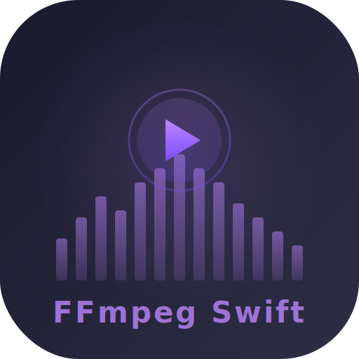

<p align="center">
  
  <h1 align="center">FFmpegSwiftSDK</h1>
  <p align="center">
    基于 FFmpeg 8.0 的 iOS 流媒体播放 Swift SDK<br/>
    HiFi 无损 · 10 段 EQ · 50+ 音效 · 音频分析 · 歌曲识别 · 歌词同步 · 语音识别歌词
  </p>
  <p align="center">
    
    
    
    
    
  </p>
</p>

---

## 特性一览

| 类别 | 功能 |
|:---|:---|
| 播放 | RTMP / HLS / RTSP / HTTP(S) / 本地文件，30+ 音频解码器，H.264 / HEVC 视频（VideoToolbox 硬解） |
| HiFi | 最高 192kHz / 32bit，FLAC / ALAC / DSD / WAV 无损直出，CoreAudio AudioUnit 渲染 |
| 均衡器 | 10 段参数 EQ（31Hz ~ 16kHz），渲染线程实时处理，零延迟 |
| 音效 | 50+ 效果：音量 · 变速 · 变调 · 低音 · 高音 · 环绕 · 混响 · 合唱 · 镶边 · 颤音 · 失真 · 电话 · 水下 · 收音机 等 |
| 分析 | BPM 检测 · 峰值检测 · 响度测量 · 动态范围 · 频率分析 · 相位检测 · 削波检测 |
| 识别 | 音频指纹生成 · 歌曲识别（类似 Shazam）· 指纹数据库 |
| 处理 | 转码 · 裁剪 · 拼接 · 重采样 · 声道转换 · 提取音频 |
| 可视化 | 实时 FFT 频谱分析（vDSP 加速）· 波形预览生成 |
| 元数据 | ID3v1/v2 · Vorbis Comment · iTunes Metadata · 专辑封面提取 |
| 歌词 | LRC 解析 · 逐字同步 · 双语歌词 · 时间偏移调整 · 语音识别生成歌词（WhisperKit） |
| 高级 | A-B 循环 · 无缝切歌（Gapless）· 交叉淡入淡出 · Seek |
| 同步 | 基于音频时钟的 A/V 同步，自动丢帧 / 重复帧补偿 |

---

## 环境要求

- iOS 16.0+ / macOS 13.0+（开发测试）
- Xcode 15.0+
- Swift 5.9+

---

## 安装

### Swift Package Manager

```swift
dependencies: [
    .package(url: "https://github.com/Lincb522/FFmpegSwiftSDK.git", from: "1.0.0")
]
```

或在 Xcode 中：**File → Add Package Dependencies** → 粘贴仓库地址。

> iOS 预编译库（`FFmpegLibs.xcframework`，约 28MB）通过 GitHub Release 自动下载，无需额外配置。

---

## 快速上手

### 基础播放

```swift
import FFmpegSwiftSDK

let player = StreamPlayer()
player.delegate = self
player.play(url: "https://example.com/music.flac")

player.pause()
player.resume()
player.seek(to: 60)
player.stop()
```

### 视频播放

```swift
// 将视频图层添加到视图
view.layer.addSublayer(player.videoDisplayLayer)
player.videoDisplayLayer.frame = view.bounds
player.play(url: "https://example.com/video.mp4")
```

### 播放状态回调

```swift
extension MyClass: StreamPlayerDelegate {
    func player(_ player: StreamPlayer, didChangeState state: PlaybackState) {
        // .idle / .connecting / .playing / .paused / .stopped / .error(_)
    }
    func player(_ player: StreamPlayer, didEncounterError error: FFmpegError) {
        print(error.description)
    }
    func player(_ player: StreamPlayer, didUpdateDuration duration: TimeInterval) {
        // 总时长（秒）
    }
    func playerDidTransitionToNextTrack(_ player: StreamPlayer) {
        // 无缝切歌完成
    }
}
```

---

## 10 段均衡器

```swift
player.equalizer.setGain(6.0, for: .hz125)   // 增强低音
player.equalizer.setGain(-3.0, for: .hz4k)   // 削减高频
player.equalizer.reset()                       // 重置全部
```

| 频段 | 频率 | 用途 |
|:---:|:---:|:---|
| `.hz31` | 31 Hz | 超低频，体感震动 |
| `.hz62` | 62 Hz | 低音下潜 |
| `.hz125` | 125 Hz | 低音力度 |
| `.hz250` | 250 Hz | 低中频温暖感 |
| `.hz500` | 500 Hz | 中频厚度 |
| `.hz1k` | 1 kHz | 中频人声 |
| `.hz2k` | 2 kHz | 中高频清晰度 |
| `.hz4k` | 4 kHz | 高频存在感 |
| `.hz8k` | 8 kHz | 高频明亮度 |
| `.hz16k` | 16 kHz | 超高频空气感 |

增益范围 **-12 ~ +12 dB**，超出自动钳位并通过 `AudioEqualizerDelegate` 通知。

---

## 音频效果

所有效果通过 `player.audioEffects` 访问，基于 FFmpeg avfilter 实时处理，共 50+ 种效果：

### 基础音量控制

```swift
player.audioEffects.setVolume(3.0)              // +3dB
```

### 速度与音调

```swift
player.audioEffects.setTempo(1.5)               // 1.5x 倍速（变速不变调）
player.audioEffects.setPitch(3)                 // 升 3 个半音（变调不变速）
```

### 均衡器与频率

```swift
player.audioEffects.setBassGain(6.0)            // +6dB 低音
player.audioEffects.setTrebleGain(-3.0)         // -3dB 高音
player.audioEffects.setSubboostEnabled(true)    // 超低音增强（100Hz 以下）
player.audioEffects.setBandpassEnabled(true)    // 带通滤波
player.audioEffects.setBandpassParams(frequency: 1000, width: 500)
player.audioEffects.setBandrejectEnabled(true)  // 带阻滤波（去除指定频率）
```

### 动态处理

```swift
player.audioEffects.setLoudnormEnabled(true)    // 响度标准化（EBU R128）
player.audioEffects.setNightModeEnabled(true)   // 夜间模式（动态压缩）
player.audioEffects.setLimiterEnabled(true)     // 限幅器（防止削波）
player.audioEffects.setGateEnabled(true)        // 噪声门
player.audioEffects.setAutoGainEnabled(true)    // 自动增益
```

### 空间效果

```swift
player.audioEffects.setSurroundLevel(0.5)       // 环绕增强
player.audioEffects.setReverbLevel(0.3)         // 混响
player.audioEffects.setStereoWidth(1.5)         // 立体声宽度（0~2）
player.audioEffects.setChannelBalance(-0.5)     // 声道平衡（-1=左，+1=右）
player.audioEffects.setMonoEnabled(true)        // 单声道
player.audioEffects.setChannelSwapEnabled(true) // 声道交换
```

### 时间效果

```swift
player.audioEffects.setFadeIn(duration: 3.0)    // 3 秒淡入
player.audioEffects.setFadeOut(duration: 5.0, startTime: 180.0)  // 淡出
player.audioEffects.setDelay(100)               // 100ms 延迟
```

### 特殊效果

```swift
player.audioEffects.setVocalRemoval(0.8)        // 人声消除（卡拉OK）
player.audioEffects.setChorusEnabled(true)      // 合唱效果
player.audioEffects.setFlangerEnabled(true)     // 镶边效果
player.audioEffects.setTremoloEnabled(true)     // 颤音效果
player.audioEffects.setVibratoEnabled(true)     // 颤抖效果
player.audioEffects.setLoFiEnabled(true)        // Lo-Fi 失真
player.audioEffects.setTelephoneEnabled(true)   // 电话效果
player.audioEffects.setUnderwaterEnabled(true)  // 水下效果
player.audioEffects.setRadioEnabled(true)       // 收音机效果

// 重置全部
player.audioEffects.reset()
```

---

## 音频分析

提供全面的音频分析功能：

```swift
// BPM 检测
let bpmResult = AudioAnalyzer.detectBPM(samples: audioSamples, sampleRate: 44100)
print("BPM: \(bpmResult.bpm), 置信度: \(bpmResult.confidence)")

// 峰值检测
let peakResult = AudioAnalyzer.detectPeak(samples: audioSamples, sampleRate: 44100)
print("峰值: \(peakResult.peakDB) dBFS, 削波: \(peakResult.isClipping)")

// 响度测量（EBU R128）
let loudness = AudioAnalyzer.measureLoudness(samples: audioSamples, sampleRate: 44100, channelCount: 2)
print("LUFS: \(loudness.integratedLUFS), 真峰值: \(loudness.truePeak) dBTP")

// 动态范围分析
let dynamic = AudioAnalyzer.analyzeDynamicRange(samples: audioSamples, sampleRate: 44100)
print("动态范围: \(dynamic.dynamicRange) dB, 波峰因数: \(dynamic.crestFactor) dB")

// 频率分析
let freq = AudioAnalyzer.analyzeFrequency(samples: audioSamples, sampleRate: 44100)
print("主频率: \(freq.dominantFrequency) Hz, 频谱质心: \(freq.spectralCentroid) Hz")
print("低/中/高频能量: \(freq.lowEnergyRatio)/\(freq.midEnergyRatio)/\(freq.highEnergyRatio)")

// 相位检测（立体声）
let phase = AudioAnalyzer.detectPhase(samples: stereoSamples, sampleRate: 44100)
print("相位相关性: \(phase.correlation), \(phase.description)")

// 静音检测
let silences = AudioAnalyzer.detectSilence(samples: audioSamples, sampleRate: 44100, threshold: -50, minDuration: 0.5)
for segment in silences {
    print("静音: \(segment.startTime)s ~ \(segment.endTime)s")
}

// 削波检测
let clipping = AudioAnalyzer.detectClipping(samples: audioSamples, sampleRate: 44100)
print("削波采样: \(clipping.clippedSamples), 严重: \(clipping.hasSevereClipping)")
```

---

## 歌曲识别（音频指纹）

类似 Shazam 的音频指纹识别功能：

```swift
// 从音频采样生成指纹
let fingerprint = AudioFingerprint.generate(samples: audioSamples, sampleRate: 44100)

// 从文件生成指纹（只取前 10 秒）
let fingerprint = try AudioFingerprint.generate(from: audioURL, duration: 10.0)

// 比较两个指纹的相似度
let similarity = AudioFingerprint.compare(fingerprint1, fingerprint2)
print("相似度: \(similarity * 100)%")

// 使用指纹数据库
let database = FingerprintDatabase()

// 添加歌曲到数据库
database.add(entry: FingerprintDatabase.Entry(
    id: "song-001",
    title: "Shape of You",
    artist: "Ed Sheeran",
    fingerprint: fingerprint
))

// 识别未知音频
if let result = database.recognize(samples: unknownSamples, sampleRate: 44100) {
    print("识别结果: \(result.title) - \(result.artist)")
    print("匹配分数: \(result.score), 置信度: \(result.confidence)")
}

// 导出/导入数据库
let data = try database.export()
try database.importData(data)
```

---

## 音频文件处理

```swift
let processor = AudioProcessor()

// 转码（MP3 → AAC）
try await processor.transcode(
    inputURL: inputURL,
    outputURL: outputURL,
    config: .init(format: .aac, bitrate: 256000)
) { progress in
    print("进度: \(progress * 100)%")
}

// 裁剪（带淡入淡出）
try await processor.trim(
    inputURL: inputURL,
    outputURL: outputURL,
    config: .init(startTime: 10.0, endTime: 30.0, fadeIn: 1.0, fadeOut: 1.0)
)

// 拼接多个文件
try await processor.concatenate(
    inputURLs: [url1, url2, url3],
    outputURL: outputURL
)

// 重采样
try await processor.resample(
    inputURL: inputURL,
    outputURL: outputURL,
    targetSampleRate: 48000
)

// 声道转换（立体声 → 单声道）
try await processor.convertChannels(
    inputURL: inputURL,
    outputURL: outputURL,
    targetChannels: 1
)

// 从视频提取音频
try await processor.extractAudio(
    inputURL: videoURL,
    outputURL: audioURL,
    format: .aac
)

// 获取音频信息
let info = try processor.getAudioInfo(url: audioURL)
print("时长: \(info.duration)s, 采样率: \(info.sampleRate), 编码: \(info.codecName)")
```

---

## 实时频谱分析

基于 vDSP 加速的 FFT 频谱分析器，输出归一化频率幅度数据供 UI 绘制：

```swift
player.spectrumAnalyzer.isEnabled = true
player.spectrumAnalyzer.smoothing = 0.7  // 平滑系数

player.spectrumAnalyzer.onSpectrum = { magnitudes in
    // magnitudes: [Float]，长度 = bandCount（默认 64）
    // 值范围 [0, 1]，在音频线程回调
    DispatchQueue.main.async {
        self.updateSpectrumUI(magnitudes)
    }
}
```

---

## 波形预览

独立于播放 pipeline，在后台解码整首歌生成波形缩略图：

```swift
let samples = try await player.waveformGenerator.generate(
    url: "file:///path/to/song.flac",
    samplesCount: 200,
    onProgress: { progress in
        print("波形生成进度: \(Int(progress * 100))%")
    }
)
// samples: [WaveformSample]
// 每个 sample 包含 .positive（正峰值）和 .negative（负峰值）
```

---

## 元数据读取

读取 ID3v1/v2、Vorbis Comment、iTunes Metadata 等标签：

```swift
let metadata = try player.metadataReader.read(url: "file:///path/to/song.flac")

print(metadata.title)       // 歌曲标题
print(metadata.artist)      // 艺术家
print(metadata.album)       // 专辑名

// 专辑封面（JPEG/PNG Data，可直接转 UIImage）
if let data = metadata.artworkData {
    let image = UIImage(data: data)
}

// 所有原始标签
for (key, value) in metadata.rawTags {
    print("\(key): \(value)")
}
```

---

## 歌词同步

LRC 解析 + 实时时间对准，支持标准 LRC、增强 LRC（逐字）、双语歌词：

```swift
// 加载 LRC 歌词
player.lyricSyncer.load(lrcContent: lrcString)

// 双语歌词
player.lyricSyncer.loadBilingual(
    originalLRC: chineseLRC,
    translationLRC: englishLRC
)

// 实时同步回调
player.lyricSyncer.onSync = { lineIndex, line, wordIndex, progress in
    // lineIndex: 当前行索引
    // line.text: 当前行文字
    // line.translation: 翻译（双语模式）
    // wordIndex: 逐字索引（增强 LRC）
    // progress: 行内进度 [0, 1]
}

// 时间偏移调整（秒，正值延后，负值提前）
player.lyricSyncer.offset = -0.5

// 获取附近歌词（滚动显示）
let nearby = player.lyricSyncer.nearbyLines(range: 3)
```

支持的 LRC 格式：

```
[ti:歌曲标题]
[ar:艺术家]
[00:05.00]这是一句歌词
[00:10.00][00:30.00]重复歌词（多时间标签）
[00:15.00]<00:15.00>逐<00:15.50>字<00:16.00>歌<00:16.50>词
```

---

## 语音识别歌词

基于 WhisperKit 的语音识别引擎，自动将音频转换为带时间戳的歌词：

```swift
let recognizer = LyricRecognizer()

// 准备模型（首次会自动下载，约 75MB）
try await recognizer.prepare()

// 识别歌词
let result = try await recognizer.recognize(url: "https://example.com/song.mp3")

// 查看结果
print("识别到 \(result.segments.count) 行歌词")
print("语言: \(result.language ?? "未知")")
print("耗时: \(result.processingTime)秒")

// 转换为 LyricLine 并加载到播放器
let lines = result.toLyricLines()
player.lyricSyncer.load(lines: lines)

// 导出为增强 LRC 格式（带逐字时间戳）
let lrc = result.toEnhancedLRC()
try lrc.write(to: outputURL, atomically: true, encoding: .utf8)
```

配置识别参数：

```swift
var config = LyricRecognizerConfig()
config.language = "zh"  // 指定语言（nil = 自动检测）
config.modelName = "base"  // 模型：tiny, base, small, medium, large-v3
config.onProgress = { progress in
    print("进度: \(Int(progress * 100))%")
}

let result = try await recognizer.recognize(url: url, config: config)
```

支持的语言：中文、英文、日文、韩文等 90+ 种语言。

详细文档：[语音识别歌词使用指南](docs/LYRIC_RECOGNITION.md)

---

## A-B 循环

精确区间循环，适用于练歌、学乐器等场景：

```swift
// 设置循环区间（播放到 B 点自动跳回 A 点）
player.setABLoop(pointA: 30.0, pointB: 60.0)

// 查询状态
player.isABLoopEnabled    // true
player.abLoopPointA       // 30.0
player.abLoopPointB       // 60.0

// 清除循环
player.clearABLoop()
```

---

## 无缝切歌 & 交叉淡入淡出

```swift
// 预加载下一首（后台连接 + 初始化解码器）
player.prepareNext(url: "https://example.com/next.flac")

// EOF 时自动无缝切换，或手动触发：
player.switchToNext()

// 交叉淡入淡出（当前歌曲淡出 + 下一首淡入）
player.setCrossfadeDuration(5.0)  // 5 秒交叉
```

---

## 流信息 & HiFi 检测

```swift
if let info = player.streamInfo {
    info.audioCodec      // "flac"
    info.sampleRate      // 96000
    info.bitDepth        // 24
    info.channelCount    // 2
    info.containerFormat // "flac"
    info.duration        // 245.3（秒）

    info.isLossless      // true
    info.isHiRes         // true（采样率 > 48kHz 或位深 > 16bit）
    info.qualityLabel    // "Hi-Res 24bit/96kHz"
}
```

---

## 编解码能力查询

```swift
// 支持的音频解码器
let audioCodecs = CodecCapabilities.supportedAudioCodecs
// [AudioCodecInfo(name: "aac", displayName: "AAC", isLossless: false, ...), ...]

// 支持的视频解码器
let videoCodecs = CodecCapabilities.supportedVideoCodecs

// 支持的容器格式
let formats = CodecCapabilities.supportedContainerFormats

// 支持的流协议
let protocols = CodecCapabilities.supportedProtocols

// 支持的音频滤镜
let filters = CodecCapabilities.supportedAudioFilters
```

---

## 架构

```
┌──────────────────────────────────────────────────────────────┐
│                      📱 Public API 层                         │
│  StreamPlayer · AudioEqualizer · AudioEffects                │
│  CodecCapabilities                                           │
├──────────────────────────────────────────────────────────────┤
│                      ⚙️ Engine 引擎层                         │
│  ConnectionManager → Demuxer → AudioDecoder / VideoDecoder   │
│  AudioRenderer (CoreAudio) · VideoRenderer (AVSampleBuffer)  │
│  EQFilter · AudioFilterGraph · AVSyncController              │
│  SpectrumAnalyzer · WaveformGenerator                        │
│  MetadataReader · LyricSyncer / LyricParser                  │
├──────────────────────────────────────────────────────────────┤
│                      🔗 Bridge 桥接层                         │
│  FFmpegFormatContext · FFmpegCodecContext                     │
├──────────────────────────────────────────────────────────────┤
│                      📐 Core / Models                         │
│  FFmpegError · StreamInfo · VideoFrame · AudioBuffer · EQBand│
├──────────────────────────────────────────────────────────────┤
│                      🔧 CFFmpeg (C 模块)                      │
│  module.modulemap → FFmpeg 8.0 C 头文件                       │
├──────────────────────────────────────────────────────────────┤
│                      📦 FFmpegLibs.xcframework                │
│  libavformat · libavcodec · libavutil                        │
│  libswresample · libavfilter                                 │
└──────────────────────────────────────────────────────────────┘
```

数据流：

```
URL → ConnectionManager → Demuxer ─┬─ AudioDecoder → AudioFilterGraph → EQFilter → AudioRenderer
                                    └─ VideoDecoder → AVSyncController → VideoRenderer
```

---

## 支持的格式

### 音频解码器

| 类型 | 格式 |
|:---|:---|
| 有损 | AAC · MP3 · Opus · Vorbis · AC-3 · E-AC-3 · DTS · WMA · Cook |
| 无损 | FLAC · ALAC · WavPack · APE · TAK · TTA |
| PCM | 16bit / 24bit / 32bit / Float32 / Float64（Hi-Res） |
| DSD | DSD64 / DSD128（LSB/MSB） |

### 视频解码器

H.264/AVC · HEVC/H.265（均支持 VideoToolbox 硬件加速）

### 容器格式

MP4/M4A/MOV · MPEG-TS · FLV · HLS · MKV/WebM · Ogg · FLAC · WAV · MP3 · AAC

### 流协议

HTTP · HTTPS · HLS · RTMP · TCP · UDP · File · Concat · Data URI

---

## 示例应用

`Example/` 目录包含完整的 SwiftUI HiFi 播放器 Demo，展示所有 SDK 功能：

- 暗色主题 + 渐变背景
- 播放 / 暂停 / 停止 / Seek 控制
- 10 段 EQ 均衡器（自定义垂直滑块）
- 音频效果面板（音量、倍速、变调、低音、高音、环绕、混响、淡入、响度标准化）
- 实时频谱可视化动画
- 波形进度条（可点击 Seek）
- 元数据显示 + 专辑封面
- 歌词同步滚动显示 + 偏移调整
- A-B 循环设置
- HiFi 品质指示

```bash
# 安装 xcodegen（如未安装）
brew install xcodegen

# 生成 Xcode 工程
xcodegen generate --spec Example/project.yml --project Example/

# 用 Xcode 打开，选择模拟器，编译运行
```

---

## 从源码编译 FFmpeg

详见 [BUILD.md](BUILD.md)。

构建脚本位于 `scripts/` 目录：

| 脚本 | 用途 |
|:---|:---|
| `build-ffmpeg-ios.sh` | 交叉编译 FFmpeg for iOS（arm64 / x86_64） |
| `rebuild-sim-and-xcframework.sh` | 重建模拟器库 + 合并 xcframework |
| `rebuild-all.sh` | 完整重建（设备 + 模拟器 + xcframework） |
| `package-and-release.sh` | 打包 xcframework zip |
| `upload-release.sh` | 上传到 GitHub Release |

---

## 完整 API 参考

<details>
<summary>StreamPlayer</summary>

```swift
public final class StreamPlayer {
    // 播放控制
    func play(url: String)
    func pause()
    func resume()
    func stop()
    func seek(to time: TimeInterval)

    // 状态
    var state: PlaybackState { get }
    var currentTime: TimeInterval { get }
    var streamInfo: StreamInfo? { get }
    weak var delegate: StreamPlayerDelegate?

    // 子系统
    let equalizer: AudioEqualizer
    let audioEffects: AudioEffects
    let spectrumAnalyzer: SpectrumAnalyzer
    let waveformGenerator: WaveformGenerator
    let metadataReader: MetadataReader
    let lyricSyncer: LyricSyncer

    // 视频
    var videoDisplayLayer: AVSampleBufferDisplayLayer { get }
    var isVideoHardwareAccelerated: Bool { get }

    // A-B 循环
    func setABLoop(pointA: TimeInterval, pointB: TimeInterval)
    func clearABLoop()
    var isABLoopEnabled: Bool { get }
    var abLoopPointA: TimeInterval? { get }
    var abLoopPointB: TimeInterval? { get }

    // 无缝切歌
    func prepareNext(url: String)
    func switchToNext(seekTo: TimeInterval?)
    func cancelNextPreparation()

    // 交叉淡入淡出
    func setCrossfadeDuration(_ duration: Float)
    var currentCrossfadeDuration: Float { get }
}
```

</details>

<details>
<summary>AudioEffects</summary>

```swift
public final class AudioEffects {
    // 基础音量
    func setVolume(_ db: Float)
    var volume: Float { get }

    // 速度与音调
    func setTempo(_ rate: Float)          // 0.5 ~ 4.0
    var tempo: Float { get }
    func setPitch(_ semitones: Float)     // -12 ~ +12
    var pitchSemitones: Float { get }

    // 均衡器与频率
    func setBassGain(_ db: Float)         // -12 ~ +12
    var bassGain: Float { get }
    func setTrebleGain(_ db: Float)       // -12 ~ +12
    var trebleGain: Float { get }
    func setSubboostEnabled(_ enabled: Bool)
    func setSubboostParams(gain: Float, cutoff: Float)
    func setBandpassEnabled(_ enabled: Bool)
    func setBandpassParams(frequency: Float, width: Float)
    func setBandrejectEnabled(_ enabled: Bool)
    func setBandrejectParams(frequency: Float, width: Float)

    // 动态处理
    func setLoudnormEnabled(_ enabled: Bool)
    func setLoudnormParams(targetLUFS: Float, lra: Float, truePeak: Float)
    func setNightModeEnabled(_ enabled: Bool)  // 动态压缩
    func setCompressorParams(threshold: Float, ratio: Float, attack: Float, release: Float, makeup: Float)
    func setLimiterEnabled(_ enabled: Bool)
    func setLimiterLimit(_ limit: Float)
    func setGateEnabled(_ enabled: Bool)
    func setGateThreshold(_ threshold: Float)
    func setAutoGainEnabled(_ enabled: Bool)

    // 空间效果
    func setSurroundLevel(_ level: Float) // 0 ~ 1
    var surroundLevel: Float { get }
    func setReverbLevel(_ level: Float)   // 0 ~ 1
    var reverbLevel: Float { get }
    func setStereoWidth(_ width: Float)   // 0 ~ 2
    var stereoWidth: Float { get }
    func setChannelBalance(_ balance: Float) // -1 ~ +1
    var channelBalance: Float { get }
    func setMonoEnabled(_ enabled: Bool)
    func setChannelSwapEnabled(_ enabled: Bool)

    // 时间效果
    func setFadeIn(duration: Float)
    func setFadeOut(duration: Float, startTime: Float)
    func setDelay(_ ms: Float)

    // 特殊效果
    func setVocalRemoval(_ level: Float)  // 0 ~ 1
    func setChorusEnabled(_ enabled: Bool)
    func setChorusDepth(_ depth: Float)
    func setFlangerEnabled(_ enabled: Bool)
    func setFlangerDepth(_ depth: Float)
    func setTremoloEnabled(_ enabled: Bool)
    func setTremoloParams(frequency: Float, depth: Float)
    func setVibratoEnabled(_ enabled: Bool)
    func setVibratoParams(frequency: Float, depth: Float)
    func setLoFiEnabled(_ enabled: Bool)
    func setLoFiParams(bits: Float, samples: Float)
    func setTelephoneEnabled(_ enabled: Bool)
    func setUnderwaterEnabled(_ enabled: Bool)
    func setRadioEnabled(_ enabled: Bool)

    func reset()
    var isActive: Bool { get }
}
```

</details>

<details>
<summary>LyricRecognizer</summary>

```swift
public final class LyricRecognizer {
    // 准备模型
    func prepare(modelName: String?) async throws
    
    // 识别歌词
    func recognize(url: String, config: LyricRecognizerConfig) async throws -> RecognizedLyric
    func recognize(samples: [Float], config: LyricRecognizerConfig) async throws -> RecognizedLyric
    func recognize(buffer: AudioBuffer, config: LyricRecognizerConfig) async throws -> RecognizedLyric
    
    // 清理资源
    func cleanup()
    
    var isReady: Bool { get }
}

public struct LyricRecognizerConfig {
    var language: String?        // 语言代码（nil = 自动检测）
    var modelName: String?       // 模型名称（nil = 自动选择）
    var wordTimestamps: Bool     // 是否启用逐字时间戳
    var onProgress: ((Float) -> Void)?  // 进度回调
}

public struct RecognizedLyric {
    let segments: [RecognizedSegment]  // 识别片段
    let language: String?              // 检测到的语言
    let processingTime: TimeInterval   // 识别耗时
    
    func toLyricLines() -> [LyricLine]  // 转换为 LyricLine
    func toEnhancedLRC() -> String      // 导出为增强 LRC
}

public struct RecognizedSegment {
    let text: String              // 片段文本
    let startTime: TimeInterval   // 开始时间
    let endTime: TimeInterval     // 结束时间
    let words: [RecognizedWord]   // 逐字数据
    let language: String?         // 语言代码
}

public struct RecognizedWord {
    let text: String              // 文字内容
    let startTime: TimeInterval   // 开始时间
    let endTime: TimeInterval     // 结束时间
    let confidence: Float         // 识别置信度
}
```

</details>

<details>
<summary>LyricSyncer</summary>

```swift
public final class LyricSyncer {
    func load(lrcContent: String)
    func load(lines: [LyricLine])
    func loadBilingual(originalLRC: String, translationLRC: String)
    func clear()

    func update(time: TimeInterval)
    func line(at time: TimeInterval) -> LyricLine?
    func nearbyLines(range: Int) -> [(index: Int, line: LyricLine)]
    func reset()

    var onSync: LyricSyncCallback?
    var offset: TimeInterval
    var currentLineIndex: Int { get }
    var currentWordIndex: Int? { get }
    var isLoaded: Bool { get }
    var lines: [LyricLine] { get }
    var metadata: LyricMetadata? { get }
}
```

</details>

<details>
<summary>AudioAnalyzer</summary>

```swift
public final class AudioAnalyzer {
    // BPM 检测
    static func detectBPM(samples: [Float], sampleRate: Int) -> BPMResult
    
    // 峰值检测
    static func detectPeak(samples: [Float], sampleRate: Int, clippingThreshold: Float) -> PeakResult
    
    // 响度测量（EBU R128）
    static func measureLoudness(samples: [Float], sampleRate: Int, channelCount: Int) -> LoudnessResult
    
    // 静音检测
    static func detectSilence(samples: [Float], sampleRate: Int, threshold: Float, minDuration: TimeInterval) -> [SilenceSegment]
    
    // 削波检测
    static func detectClipping(samples: [Float], sampleRate: Int, threshold: Float) -> ClippingResult
    
    // 相位检测（立体声）
    static func detectPhase(samples: [Float], sampleRate: Int) -> PhaseResult
    
    // 频率分析
    static func analyzeFrequency(samples: [Float], sampleRate: Int) -> FrequencyAnalysis
    
    // 动态范围分析
    static func analyzeDynamicRange(samples: [Float], sampleRate: Int) -> DynamicRangeResult
}
```

</details>

<details>
<summary>AudioFingerprint</summary>

```swift
public final class AudioFingerprint {
    // 从采样生成指纹
    static func generate(samples: [Float], sampleRate: Int) -> Fingerprint
    
    // 从文件生成指纹
    static func generate(from url: URL, duration: TimeInterval?) throws -> Fingerprint
    
    // 比较两个指纹
    static func compare(_ fp1: Fingerprint, _ fp2: Fingerprint) -> Float
    
    // 在数据库中搜索
    static func search(query: Fingerprint, in database: [String: Fingerprint], threshold: Float) -> [MatchResult]
}

public final class FingerprintDatabase {
    func add(entry: Entry)
    func remove(id: String)
    func recognize(samples: [Float], sampleRate: Int) -> RecognitionResult?
    var count: Int { get }
    func export() throws -> Data
    func importData(_ data: Data) throws
}
```

</details>

<details>
<summary>AudioProcessor</summary>

```swift
public final class AudioProcessor {
    // 转码
    func transcode(inputURL: URL, outputURL: URL, config: TranscodeConfig, progress: ProgressCallback?, completion: CompletionCallback)
    
    // 裁剪
    func trim(inputURL: URL, outputURL: URL, config: TrimConfig, progress: ProgressCallback?, completion: CompletionCallback)
    
    // 拼接
    func concatenate(inputURLs: [URL], outputURL: URL, progress: ProgressCallback?, completion: CompletionCallback)
    
    // 重采样
    func resample(inputURL: URL, outputURL: URL, targetSampleRate: Int, progress: ProgressCallback?, completion: CompletionCallback)
    
    // 声道转换
    func convertChannels(inputURL: URL, outputURL: URL, channelCount: Int, progress: ProgressCallback?, completion: CompletionCallback)
    
    // 提取音频
    func extractAudio(from inputURL: URL, to outputURL: URL, format: OutputFormat, progress: ProgressCallback?, completion: CompletionCallback)
    
    // 获取信息
    func getAudioInfo(url: URL) throws -> AudioInfo
}
```

</details>

---

## 许可证

本项目采用 [MIT 许可证](LICENSE)。

FFmpeg 采用 LGPL 2.1 许可证，本 SDK 以静态库方式链接。详见 [FFmpeg 许可证](https://ffmpeg.org/legal.html)。
